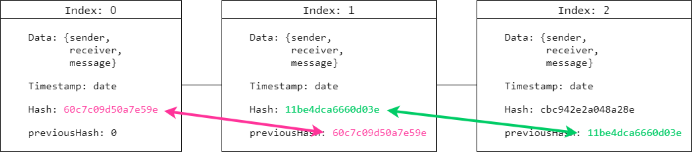
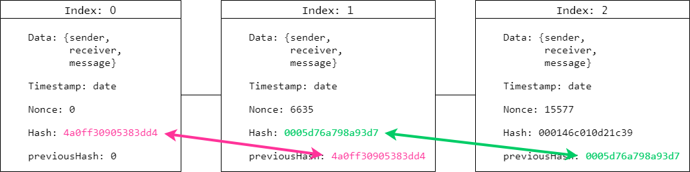

# Blockchain built using ES6 native JavaScript and Node

## Blocks
Each block consist of;
* An index
* Some data (in our case a sender, a receiver and a message)
* A timestamp
* A hash

The hash is produced from everything else contained within the block. If any content in the block is changed, the hash is also changed.

## The chain

# Make it immutable
By keeping a reference to the previous block in the chain, the chain in practice becomes immutable. If anyone changes the content in a block, all the subsequent blocks will be invalidated.

# Proof of Work
Computing power is cheap and fast, so you could still tamper the chain by updating your block and then recalculating all hashes in the chain. This is solved by 'Proof of Work'. You need to provide proof that you've put in the computational work into a chain. The processing of that is called 'mining'. Achieving 'Proof of Work' is done by creating a hash start with a number of zeros; something referred to as 'difficulty'.

# Genesis block
Each chain start with a Genesis block with index 0.
