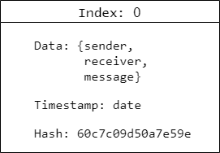
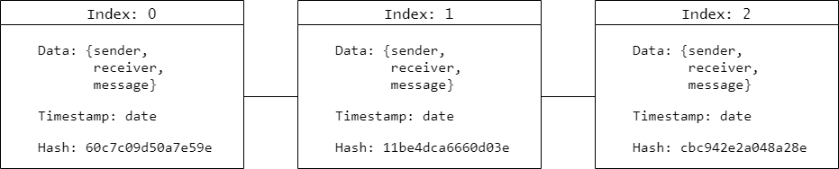

# Blockchain built using ES6 native JavaScript and Node

## Blocks
Each block consist of;
* An index
* Some data (in our case a sender, a receiver and a message)
* A timestamp
* A hash

The hash is produced from everything else contained within the block. If any content in the block is changed, the hash is also changed.

## The chain

# Genesis block
Each chain start with a Genesis block with index 0.
